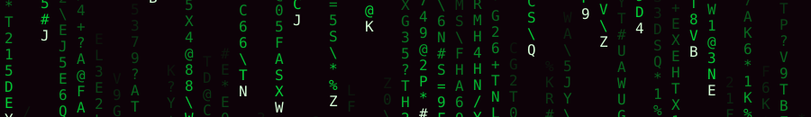

<div align="center">

# JUAN ABIMAEL SANTOS CASTILLO



[](https://github.com/Abimael10)

</div>

```bash
┌─[neo@matrix-01x]─[~]─[23:59:59]
└─# whoami
```

<div align="center">

```
┏━━━━━━━━━━━━━━━━━━━━━━━━━━━━━━━━━━━━━━━━━━━━━━━━━━━━━━━━━┓
┃ user      : Juan Abimael Santos Castillo  ·  @Abimael10 ┃
┃ location  : Santo Domingo, Dominican Republic           ┃
┃ role      : developer                                   ┃
┃ stack     : Rust · TypeScript · Python · Docker · Linux ┃
┃ currently : tinkering with Rust, mostly                 ┃
┃ fuel      : caffeine [████████░░]                       ┃
┃ status    : ONLINE  ·  following the white rabbit       ┃
┗━━━━━━━━━━━━━━━━━━━━━━━━━━━━━━━━━━━━━━━━━━━━━━━━━━━━━━━━━┛
```


</div>

```bash
┌─[neo@matrix-01x]─[~]─[23:59:59]
└─# shutdown -h now "Neural backup complete. See you in the next reality."
```

<div align="center">

**Connection to matrix-01x closed.**  ·  follow the white rabbit 🐇

</div>
